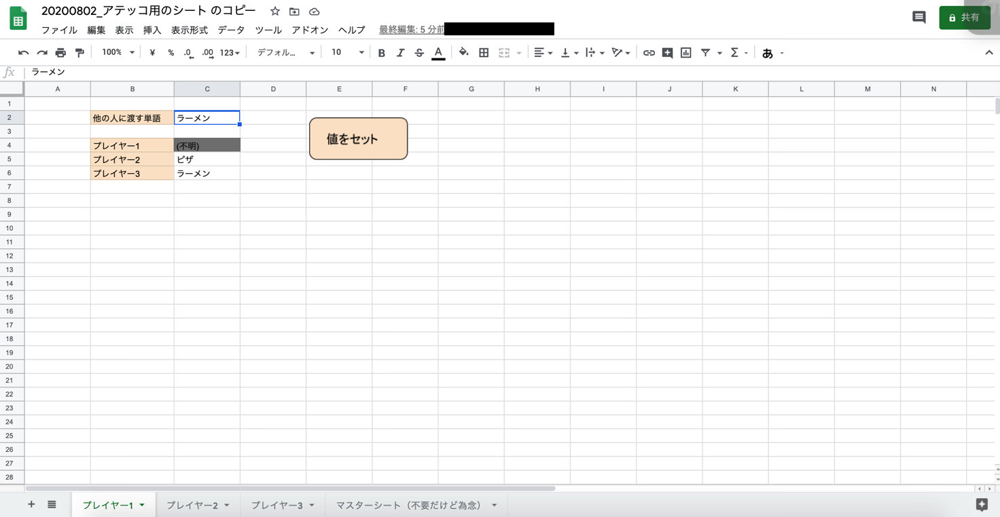

# AtekkoSheet

Let's play Atekko in the Google Spreadsheet.

# Table of Contents

- [AtekkoSheet](#atekkosheet)
- [Table of Contents](#table-of-contents)
- [What is Atekko](#what-is-atekko)
- [Usage](#usage)

# What is Atekko

Refer the rule of "Atekko" [here](https://www.youtube.com/watch?v=giUch-ZI_Mw).

# Usage

The structure of sheet is here.

1. You input a value to `C2` cell in accordance with the subject in your sheet.
2. If everyone finishes inputing a value, player1 clicks the button of `値をセット`.
3. You ask the questions each other in order to know the value input as `(不明)` in your sheet quickly. Enjoy!
